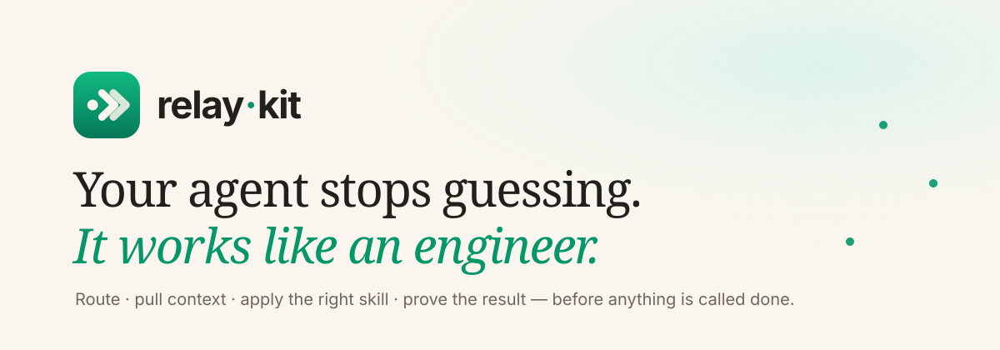

[English](README.md) | [Tiếng Việt](README.vi.md)

# Relay-kit



Relay-kit is a runtime skill system for teams building with coding agents.

It does not try to make the model magically smarter. It makes the way of working
more disciplined: a clearer start, skills with contracts, tighter
plan/build/debug/review, and evidence kept in artifacts instead of only in chat.

## Install in 60 seconds

Pick the agent you use and copy one block. By default Relay-kit installs the full
runtime: skills, slash commands, agent profiles, the `.relay-kit/` artifact, and a
doctor check. You do not need to add `--bundle enterprise`.

### Codex

```bash
pip install relay-kit
relay-kit . --codex
relay-kit doctor .
```

### Claude

```bash
pip install relay-kit
relay-kit . --claude
relay-kit doctor .
```

### Antigravity / Agent

```bash
pip install relay-kit
relay-kit . --antigravity
relay-kit doctor .
```

Use `.` when you are already inside the project you want to set up. To install into
another folder, replace `.` with the project path.

Pick one adapter per run: `--codex`, `--claude`, or `--antigravity`. Use `--all` when
you genuinely want to generate all three surfaces at once, which writes
`.claude/skills`, `.codex/skills`, and `.agent/skills` from one source of truth.

## Install from GitHub source

If PyPI is not available yet, or you want the latest build on `main`:

```bash
pipx install "git+https://github.com/b0ydeptraj/Relay-kit.git"
relay-kit . --codex
relay-kit doctor .
```

## Why Relay-kit

Agent workflows tend to break at the same points:

- coding starts before the problem is understood
- the implementation drifts from what was actually approved
- bugs get patched without finding the root cause
- "done" is claimed before there is enough evidence

Relay-kit closes those gaps with routing, skill contracts, shared state, readiness
gates, and a proof audit.

## What you get

- runtime skills for `.codex/skills`, `.claude/skills`, and `.agent/skills`
- shared artifacts under `.relay-kit/`
- `memory-search` to recover past decisions and handoffs
- `context audit`, `lane audit`, `adapter diagnose`, `command diagnose`, and `agent diagnose`
- `release-readiness`, `accessibility-review`, `skill-gauntlet`, and `context-continuity`
- a local context engine for paths, symbols, imports, tests, docs, chunks, call
  hints, git history, SQLite FTS, active context, and a local MCP, with no API key
- `battle-audit`, `battle-benchmark`, `skill-battle`, and `competency-battle` to catch
  generic resources, measure context retrieval, and score each skill against evidence
- `readiness check` for local governance proof
- a Pulse report and signal export for quality review

## Core Skill System

The public front door should be about the strongest part of Relay-kit: routing,
context, battle proof, adapter governance, and readiness gates.

| Runtime layer | Signature skill / command | What it does |
| --- | --- | --- |
| Intent routing | `workflow-router`, `repo-map`, `prompt enhance` | turn a short or vague request into a clear ask / scout / act direction with read-first files |
| Local codebase understanding | `context index`, `context search`, `context related`, `context explain-symbol` | find paths, symbols, tests, docs, config, and active context on the machine, with no API key |
| Code delivery | `developer`, `fix-hub`, `execution-loop`, `test-first-development` | keep changes small, tested, and anchored to the real repo structure |
| Debug and review | `debug-hub`, `root-cause-debugging`, `review-hub`, `qa-governor` | go from symptom to evidence, then from evidence to a clear verdict |
| Engineering specialties | `api-integration`, `data-persistence`, `dependency-management`, `testing-patterns`, `go-service-engineering`, `next-product-frontend` | apply battle-tested competency patterns for backend, frontend, dependencies, and testing |
| Proof gates | `policy-guard`, `runtime-doctor`, `skill-gauntlet`, `readiness check`, `skill-battle`, `competency-battle` | check adapters, skill behavior, local governance, and claim limits |

Specialized extension packs still live in the technical catalog, but they are not the
main README story. See [`docs/site/index.md`](docs/site/index.md) for the full skill
catalog. The front page should make Relay-kit read as a disciplined runtime skill
system, not a loose list of skills.

## Adapter support

| Flag | Output | Works with |
| --- | --- | --- |
| `--claude` | `.claude/skills/` | Claude Code |
| `--codex` | `.codex/skills/` | OpenAI Codex |
| `--antigravity` | `.agent/skills/` | Antigravity, custom agents |
| `--all` | all three | generate everything at once |
| `--generic` | `.relay-kit-prompts/` | any agent that reads prompt files |

## Bundles and internals

The public `relay-kit` installer is a thin wrapper over `relay_kit.py`, the
registry-native generator. The installer's `--all` flag maps to `--ai all` on
`relay_kit.py`, which writes every adapter surface from one registry.

Skills are grouped into bundles, selectable with `--bundle`:

| Bundle | Contains |
| --- | --- |
| `core` | orchestrators and workflow hubs |
| `orchestration` | core plus roles and cleanup skills |
| `runtime` | the full non-enterprise runtime |
| `baseline` | runtime plus approved discipline overlays |
| `enterprise` | everything, including the specialized extension packs (default) |

```bash
python relay_kit.py . --ai all --bundle baseline
```

## Useful commands

```bash
relay-kit --list-skills
relay-kit init /path/to/project --all
relay-kit manifest write /path/to/project
relay-kit doctor /path/to/project --policy-pack enterprise
relay-kit readiness check /path/to/project --profile enterprise --json
```

When the local gates are clean the verdict is `local-governance-ready-candidate`.
Attach remote CI, release, support, or user-validation evidence to the readiness
output when you have it.

## Start flow

| Goal | Public name | Behind the scenes |
|---|---|---|
| find where to start | `start-here` | `workflow-router` |
| shape an idea | `brainstorm` | `brainstorm-hub` |
| slice approved work | `write-steps` | `scrum-master` |
| implement a slice | `build-it` | `developer` |
| review a branch or PR | `review-pr` | `review-hub` |
| disciplined debugging | `debug-systematically` | `debug-hub` + `root-cause-debugging` |
| a real readiness verdict | `ready-check` | `review-hub` + `qa-governor` |
| force a final proof pass | `prove-it` | `evidence-before-completion` |

## More docs

- [`docs/site/index.md`](docs/site/index.md)
- [`docs/public-docs-index.md`](docs/public-docs-index.md)
- [`docs/relay-kit-start-flow.md`](docs/relay-kit-start-flow.md)
- [`docs/relay-kit-review-flow.md`](docs/relay-kit-review-flow.md)
- [`docs/relay-kit-readiness-check.md`](docs/relay-kit-readiness-check.md)
- [`docs/how-to-write-skills.md`](docs/how-to-write-skills.md)
- [Contributing](CONTRIBUTING.md)
